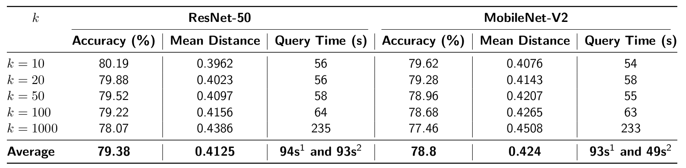
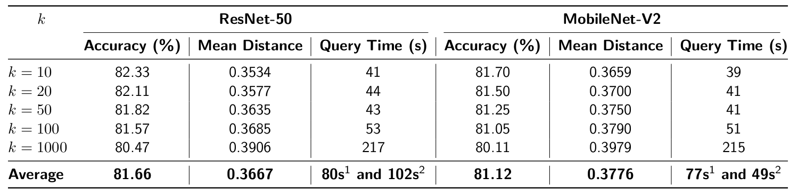

# Face Image Retrieval Using Deep Learning Models

## Overview
This project demonstrates an end-to-end pipeline for face image retrieval using the CelebA dataset. It includes modules for:
- Data preparation and preprocessing.
- Feature embedding computation using deep learning models.
- Fine-tuning with triplet loss to improve retrieval performance.
- Streamlit-based user interface for query-based image retrieval.

The project is divided into several components, including the `lib` folder for utility scripts and the `fine_tuning` folder for advanced model training and evaluation.

## CelebA Dataset
The CelebA dataset is a large-scale face attributes dataset with more than 200,000 celebrity images, each annotated with 40 attribute labels. It is widely used for various computer vision tasks, including face detection, attribute prediction, and face image retrieval. For more information, visit the [CelebA dataset homepage](https://mmlab.ie.cuhk.edu.hk/projects/CelebA.html).


---

## Project Structure
```
project/
├── .streamlit/           # Streamlit configuration files.
├── fine_tuning/          # Scripts and models for fine-tuning.
├── image/                  # Images for README and documentation.
├── lib/                  # Utility scripts for data preparation and processing.
├── backend_storage/      # Input and processed images.
├── lottiefiles/          # Lottie animations for the Streamlit app.
├── notebooks/            # Jupyter notebooks for exploratory work.
├── README.md             # Project documentation.
├── requirements.txt      # Python dependencies.
├── streamlit_file.py     # Streamlit app script.
├── *.pdf                 # Additional documentation files.
└── LICENSE.txt           # License information.
```

---

## Key Features

1. **Data Preparation:**
   - Download and preprocess the CelebA dataset.
   - Detect and crop faces for focused retrieval tasks.

2. **Embedding Generation:** Generate feature embeddings using pre-trained models like MobileNetV2 and ResNet50.

3. **Fine-Tuning:** Optimize embedding spaces using triplet loss for improved retrieval accuracy.

4. **Image Retrieval:** Query an image and retrieve the top-K most similar images using KDTree for efficient similarity searches.

5. **Visualization and Evaluation**
   - Visualize query and gallery images with distance scores.
   - Evaluate retrieval performance using precision and recall metrics.

6. **User Interface:** Streamlit-based app for user-friendly interaction with the retrieval system.

---

## Installation
### Prerequisites

You should install or update the following packages before running the scripts:
```bash
pip install -r requirements.txt
```

In addition, your device should be embodied GPU for faster training and inference. If you don't have a GPU, it is difficult to execute in Fine-Tuning part.

## Usage

1. **Data Preparation:** Run the following script to download and preprocess the CelebA dataset:
```bash
python lib/pipeline.py
```

2. **Generate Embeddings:** Generate feature embeddings using MobileNetV2 or ResNet50:
```bash
python fine_tuning/compute_embedding_celebA.py
```

3. **Fine-Tune the Model:** Fine-tune the model with triplet loss to optimize embeddings:
```bash
python fine_tuning/finetuningPipeline.py
```

4. **Query and Retrieval:** Use the Streamlit app to interact with the system:
```bash
streamlit run streamlit_file.py
```
Upload or take a picture to retrieve similar images from the dataset.

---

## Results

### Before and After Fine-Tuning

The performance of the ResNet-50 and MobileNet-V2 models was evaluated on the face image retrieval task, focusing on **accuracy**, **mean distance**, and **query time**. The comparison reveals significant improvements in retrieval quality and computational efficiency after fine-tuning.

1. **Before Fine-Tuning:**



2. **After Fine-Tuning:**



**Insights on Model Suitability:**
   - **ResNet-50** delivers higher retrieval accuracy and more refined embedding spaces but at the cost of higher query times, especially for larger \( k \) values.
   - **MobileNet-V2**, though slightly less accurate, offers a faster and more resource-efficient alternative, particularly for real-time applications.

Overall, fine-tuning significantly enhanced both models' accuracy and retrieval quality, with notable improvements in mean distance and query efficiency. These findings emphasize the critical role of fine-tuning in optimizing models for practical face image retrieval tasks.

### Fine-Tuning Performance Analysis

The fine-tuning process was conducted using two backbone models: **ResNet-50** and **MobileNet-V2**. The results are summarized in the graphs, showing both **triplet loss** (red) and **training time per epoch** (blue) across multiple epochs.


**Performance Insights:**
   - **ResNet-50** achieved a lower final triplet loss, suggesting superior embedding quality and retrieval performance at the cost of longer training time.
   - **MobileNet-V2**, while not as precise in terms of loss, offers a faster and more resource-efficient alternative, making it ideal for scenarios with limited computational resources.

The choice between these models depends on the trade-off between retrieval accuracy (favoring ResNet-50) and computational efficiency (favoring MobileNet-V2). These findings guide the selection of the backbone model for specific use cases in face image retrieval tasks.

### Image Retrieval and Visualization

**Query Architecture:** The image retrieval system uses a **KDTree** data structure to efficiently search for similar images based on feature embeddings. The system retrieves the top-K most similar images from the dataset, which are then displayed to the user for visual inspection.


The images showcase the query results for a sample image using the **MobileNet-V2 (left)** and **ResNet-50 (right)** models after fine-tuning. Both models demonstrate significant improvements in retrieval quality compared to their pre-fine-tuning counterparts.

1. **ResNet-50:**


2. **MobileNet-V2:**


After fine-tuning, **ResNet-50** emerges as the better choice for tasks requiring high retrieval precision, while **MobileNet-V2** is an excellent alternative for applications where speed and computational efficiency are prioritized. Both models significantly benefit from fine-tuning, which enhances their ability to retrieve relevant results.

---

## Demo

The Streamlit app provides an interactive interface for querying and retrieving similar images from the CelebA dataset. Users can upload or capture an image and view the top-K most similar images based on the selected model and fine-tuning configuration. Below is an example of the app interface:

https://github.com/user-attachments/assets/8b32e53e-9e7a-4f2d-b1cf-7a9f20761fda

---

## Contributions
Contributions are welcome! Please feel free to submit issues or pull requests to improve the project.

---

## Notes
- Ensure that the directory structure matches the required setup.
- If using Kaggle for the first time, configure it with your Kaggle credentials.
- Check for compatibility between installed Python packages and dependencies.

---

## License
This project is licensed under the MIT License. See [`LICENSE`](LICENSE.txt) for more details.

